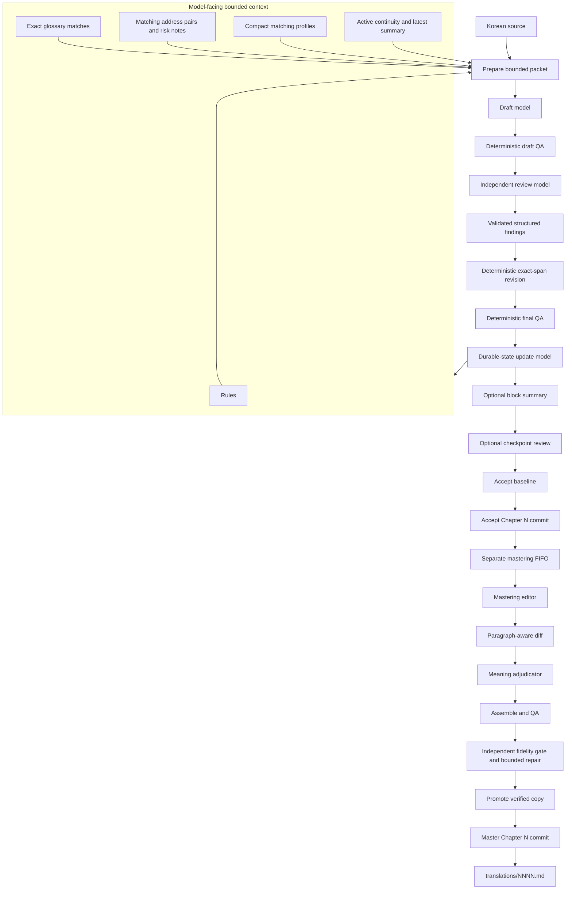
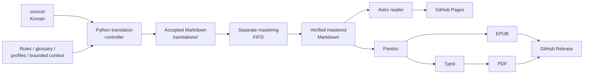

# Murim Login — English Translation

A consistent English translation of **Murim Login**, built from the Korean source and maintained as Markdown.

**Read online:** https://murim-login.com/
**PDF / EPUB:** https://github.com/jimzrt/murim-login/releases/tag/ebook

## Why this exists

Existing chapters of *Murim Login* are scattered around the web across multiple translation sources. Quality ranges from good to barely readable, and terminology, names, character voices, and formatting often change between chapters.

The goal of this project is not simply to machine-translate the novel again. It is to produce **one reasonably high-quality and, most importantly, consistent English edition**.

The translations live in [`translations/`](translations/) as ordinary Markdown files. They can therefore be reviewed, diffed, corrected, and improved through pull requests instead of being opaque generated output.

This is an LLM-assisted translation project, not a claim of perfect automatic translation. The pipeline spends substantially more compute than a one-pass translation because terminology, continuity, semantic review, QA, durable project state, and publication are separate controlled stages. Per-chapter cost and timing vary; inspect actual usage with `python tools/cost_report.py --chapter N`.

## Workflow overview

Routine translation is a controller-driven transaction for exactly one chapter. The authoritative next action is always reported by `python tools/workflow.py status N`; do not infer a stage from conversation history or skip stages.



### Translation transaction

The normal entry point is:

```bash
python tools/run_next.py
```

It reads the next chapter from `docs/STATE.md`, asks `workflow.py status N` for every transition, and executes only the reported action. At `READY`, context or profile compression runs first when configured thresholds are exceeded. The normal stages are:

1. Prepare a bounded, spoiler-safe packet from the Korean source and matching project context.
2. Draft the chapter with the configured draft model.
3. Run deterministic QA.
4. Review the draft with an independent model that returns structured findings containing exact finished replacements.
5. Apply those replacements deterministically and atomically; revision makes no model call.
6. Generate durable names, addresses, profiles, bounded context, state, and the chapter beat with the bounded update stage.
7. At configured intervals, generate a block summary and checkpoint review.
8. Accept the baseline translation.
9. Commit the deterministic accept path as `Accept Chapter N` and register the exact commit.

The translation runner stops after the chapter reaches `COMMITTED`. It never silently starts the next chapter. `translations/NNNN.md` is not created until the `accept` stage.

Use `python tools/run_until.py N` only when you explicitly want to repeat the one-chapter runner through a target chapter. It still processes chapters sequentially and does not skip a failed chapter.

### Separate mastering transaction

Mastering is a lagging FIFO queue, not a stage inside the translation transaction. Run it separately:

```bash
python tools/run_next_mastering.py
```

The mastering runner selects the oldest `COMMITTED` chapter that has not been promoted. It runs the mastering editor, paragraph-aware hunk adjudication, assembly, deterministic QA, and an independent fidelity gate. Fidelity findings may trigger bounded automatic repair rounds; unresolved major or critical fidelity failures block promotion. A verified copy is then promoted into `translations/NNNN.md`, committed as `Master Chapter N`, and registered as `MASTERED_COMMITTED`.

Translation and mastering can run concurrently. They use separate work locks, while Git commits wait for `.work/commit.lock`. Inspect lock status with:

```bash
python tools/run_lock.py
```

Use `python tools/run_until_mastering.py N` to process the mastering queue sequentially through a target chapter with the configured bounded retries.

## What the pipeline guarantees

Model output is never accepted directly. The pipeline uses:

* bounded context instead of feeding the complete novel into every request;
* a persistent terminology and names ledger;
* spoiler-safe character profiles and continuity state;
* explicit translation and style rules;
* dedicated draft, review, update, summary, and checkpoint model roles;
* deterministic QA between stages;
* structured review findings with exact replacements rather than uncontrolled rewrites;
* durable hashes, transaction state, and path-set checks;
* a separate mastering editor whose changes are diffed and meaning-adjudicated;
* an independent fidelity gate before mastering promotion;
* separate Git checkpoints for acceptance and mastering.

Checkpoint findings are retained as structured deferred-retrofit records. They do not block publication of the current chapter. A targeted retrospective pass over already accepted chapters uses the separate `audit_range.py` workflow and never advances ordinary chapter state or durable context.

## Architecture



| Layer                      | Technology                  |
| -------------------------- | --------------------------- |
| Translation orchestration  | Python                       |
| Translation storage         | Markdown                     |
| Web reader                 | Astro, TypeScript / Node.js  |
| EPUB generation             | Pandoc                       |
| PDF generation              | Pandoc + Typst               |
| Document filtering/styling | Lua, CSS, Typst              |
| CI / publication            | GitHub Actions               |

## Reader and releases

Markdown is the canonical format.

Every push to `master` automatically rebuilds and deploys the web reader through GitHub Actions. The reader supports chapter navigation, filtering, reading progress, configurable width/font size, light and dark themes, and related reading features.

A second workflow builds the complete translation as **PDF and EPUB** and updates a rolling GitHub release. The web version, EPUB, and PDF therefore all originate from the same translated Markdown.

```text
translations/*.md
        │
        ├──> Astro ─────────────> GitHub Pages
        │
        ├──> Pandoc ────────────> EPUB
        │
        └──> Pandoc + Typst ────> PDF
                                   │
                          rolling GitHub release
```

## Contributing

The final chapters are deliberately stored as Markdown rather than generated binaries.

If a translation is awkward, inconsistent, or wrong, use **Report line** on https://murim-login.com/ (select the English, say what is wrong, submit). That opens a GitHub issue. You can also use the [line-report issue form](https://github.com/jimzrt/murim-login/issues/new?template=line-report.yml) or open a pull request against [`translations/`](translations/). Operator setup is in [`docs/LINE_REPORT.md`](docs/LINE_REPORT.md).

The objective is not to claim that an automated pipeline produces a perfect translation. It is to maintain a **consistent, inspectable, and continuously improvable edition** of the novel.

## Operator documentation

* [`AGENTS.md`](AGENTS.md) — binding routine operating rules for the harness.
* [`docs/WORKFLOW.md`](docs/WORKFLOW.md) — recovery, context hygiene, checkpoints, audits, exports, and operational details.
* [`README_MASTERING.md`](README_MASTERING.md) — mastering queue, overlay stages, fidelity gate, retries, and manual mastering commands.
* [`RULES.md`](RULES.md) — binding translation and formatting policy.
