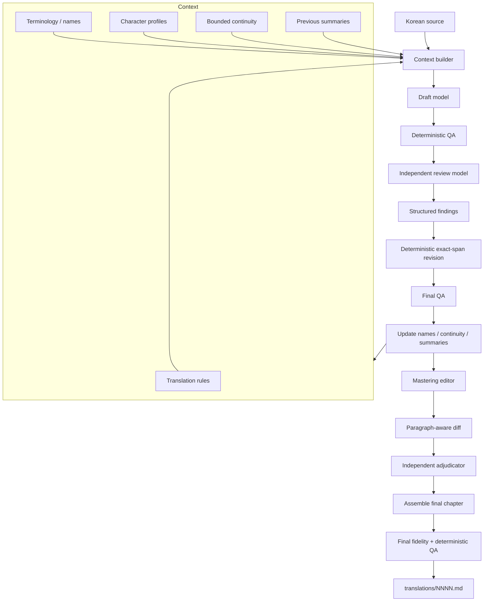
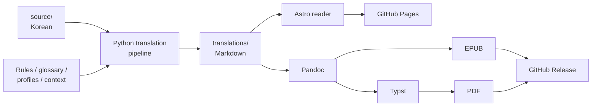

# Murim Login — English Translation

A consistent English translation of **Murim Login**, built from the Korean source and maintained as Markdown.

**Read online:** https://murim-login.com/
**PDF / EPUB:** https://github.com/jimzrt/murim-login/releases/tag/ebook

## Why this exists

Existing chapters of *Murim Login* are scattered around the web across multiple translation sources. Quality ranges from good to barely readable, and terminology, names, character voices, and formatting often change between chapters.

The goal of this project is not simply to machine-translate the novel again. It is to produce **one reasonably high-quality and, most importantly, consistent English edition**.

The translations live in [`translations/`](translations/) as ordinary Markdown files. They can therefore be reviewed, diffed, corrected, and improved through pull requests instead of being opaque generated output.

This is still a work in progress. The pipeline deliberately spends significantly more compute than a simple translation pass: a chapter currently requires a substantial token budget and roughly **30 minutes** to process.

## Translation workflow



The important part is that model output is **not accepted directly**.

The pipeline uses:

* a bounded context instead of feeding the complete novel into every request;
* a persistent terminology and names ledger;
* spoiler-safe character profiles and continuity state;
* explicit translation and style rules;
* a dedicated draft model and an independent review model;
* deterministic QA between stages;
* structured review findings with exact replacements rather than another uncontrolled rewrite;
* a separate mastering pass whose changes are diffed and independently adjudicated;
* hashes and transaction state so failed or stale runs stop instead of silently continuing.

The Python controller decides which stage is allowed to run next. The models translate and review; they do not control the workflow.

That does not make this human translation. It is still LLM-assisted translation. The difference is that consistency, terminology, continuity, review, and publication are treated as an engineering pipeline rather than as one prompt followed by `save output`.

## Architecture



| Layer                      | Technology                  |
| -------------------------- | --------------------------- |
| Translation orchestration  | Python                      |
| Translation storage        | Markdown                    |
| Web reader                 | Astro, TypeScript / Node.js |
| EPUB generation            | Pandoc                      |
| PDF generation             | Pandoc + Typst              |
| Document filtering/styling | Lua, CSS, Typst             |
| CI / publication           | GitHub Actions              |

## Reader and releases

Markdown is the canonical format.

Every push to `master` automatically rebuilds and deploys the web reader through GitHub Actions. The reader supports chapter navigation, filtering, reading progress, configurable width/font size, light and dark themes, and related reading features.

A second workflow builds the complete translation as **PDF and EPUB** and updates a rolling GitHub release. The web version, EPUB, and PDF therefore all originate from the same translated Markdown.

```text
translations/*.md
       │
       ├──> Astro ─────────────> GitHub Pages
       │
       ├──> Pandoc ────────────> EPUB
       │
       └──> Pandoc + Typst ────> PDF
                                  │
                         rolling GitHub release
```

## Contributing

The final chapters are deliberately stored as Markdown rather than generated binaries.

If a translation is awkward, inconsistent, or wrong, open a pull request against the relevant file in [`translations/`](translations/). Improvements can then be reviewed as normal source changes and automatically propagate to the web, EPUB, and PDF editions.

The objective is not to claim that an automated pipeline produces a perfect translation. It is to maintain a **consistent, inspectable, and continuously improvable edition** of the novel.
